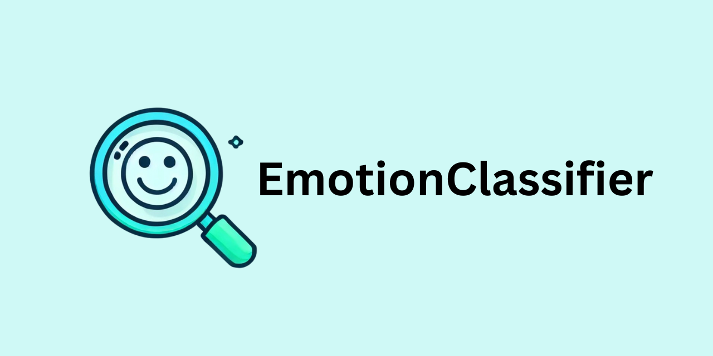

[](https://www.python.org) [](https://github.com/psf/black) [](https://github.com/astral-sh/ruff) [](https://github.com/PyCQA/bandit) 




# Emotion Classifier

A flexible emotion classifier package with support for multiple models, customizable preprocessing, visualization tools, fine-tuning capabilities, and more.

## Overview

`emotionclassifier` is a Python package designed to classify emotions in text using various pre-trained models from Hugging Face's Transformers library. This package provides a user-friendly interface for emotion classification, along with tools for data preprocessing, visualization, fine-tuning, and integration with popular data platforms.

## Features

- **Multiple Model Support**: Easily switch between different pre-trained models.
- **Customizable Preprocessing**: Clean and preprocess text data with customizable functions.
- **Visualization Tools**: Visualize emotion distributions and trends over time.
- **Fine-tuning Capability**: Fine-tune models on your own datasets.
- **User-friendly CLI**: Command-line interface for quick emotion classification.
- **Integration with Data Platforms**: Seamless integration with pandas DataFrames.
- **Extended Post-processing**: Additional utilities for detailed emotion analysis.

## Installation

You can install the package using pip:

```bash
pip install emotionclassifier
```

## Usage

### Basic Usage

Here's an example of how to use the `EmotionClassifier` to classify a single text:

```python
from emotionclassifier import EmotionClassifier

# Initialize the classifier with the default model
classifier = EmotionClassifier()

# Classify a single text
text = "I am very happy today!"
result = classifier.predict(text)
print("Emotion:", result['label'])
print("Confidence:", result['confidence'])
```

### Batch Processing

You can classify multiple texts at once using the `predict_batch` method:

```python
texts = ["I am very happy today!", "I am so sad."]
results = classifier.predict_batch(texts)
print("Batch processing results:", results)
```

### Visualization

To visualize the emotion distribution of a text:

```python
from emotionclassifier import plot_emotion_distribution

result = classifier.predict("I am very happy today!")
plot_emotion_distribution(result['probabilities'], classifier.labels.values())
```

### CLI Usage

You can also use the package from the command line:

```bash
emotionclassifier --model deberta-v3-small --text "I am very happy today!"
```

### DataFrame Integration

Integrate with pandas DataFrames to classify text columns:

```python
import pandas as pd
from emotionclassifier import DataFrameEmotionClassifier

df = pd.DataFrame({
    'text': ["I am very happy today!", "I am so sad."]
})

classifier = DataFrameEmotionClassifier()
df = classifier.classify_dataframe(df, 'text')
print(df)
```

### Emotion Trends Over Time

Analyze and plot emotion trends over time:

```python
from emotionclassifier import EmotionTrends

texts = ["I am very happy today!", "I am feeling okay.", "I am very sad."]
trends = EmotionTrends()
emotions = trends.analyze_trends(texts)
trends.plot_trends(emotions)
```

### Fine-tuning

Fine-tune a pre-trained model on your own dataset:

```python
from emotionclassifier.fine_tune import fine_tune_model

# Define your train and validation datasets
train_dataset = ...
val_dataset = ...

# Fine-tune the model
fine_tune_model(classifier.model, classifier.tokenizer, train_dataset, val_dataset, output_dir='fine_tuned_model')
```


### Running Tests

Run the tests using pytest:

```bash
poetry run pytest
```


### License

This project is licensed under the MIT License - see the [LICENSE](LICENSE) file for details.

## Acknowledgements

This package uses pre-trained models from the [Hugging Face Transformers library](https://github.com/huggingface/transformers).
